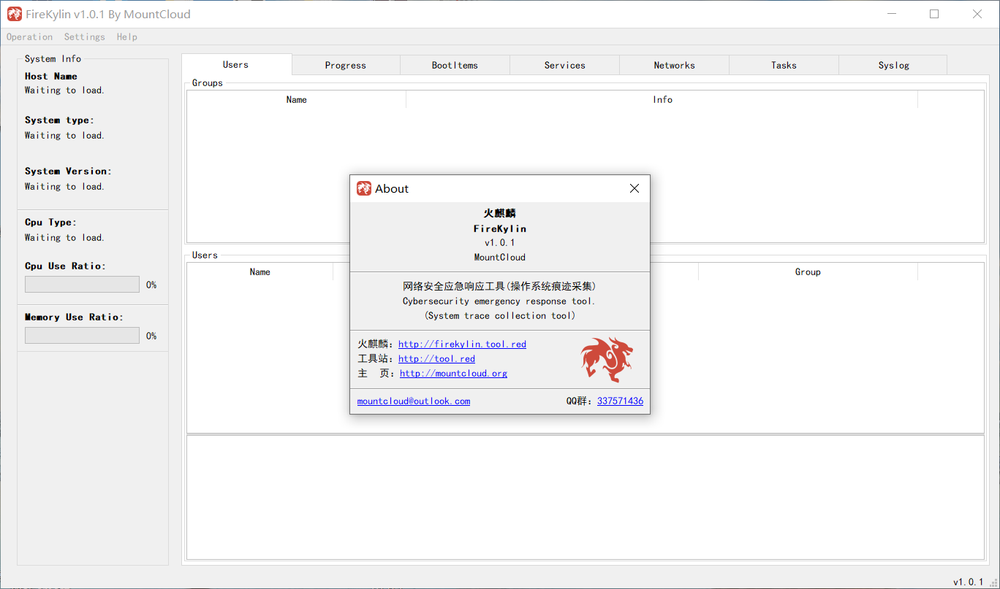
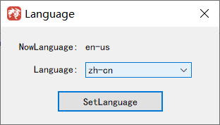
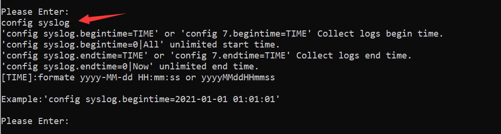

# 网络安全应急响应工具(系统痕迹采集)-FireKylin

# FireKylin介绍

&nbsp;&nbsp;&nbsp;&nbsp;FireKylin中文名称叫：火麒麟，其实跟某氪金游戏火麒麟并没有关系，作为国产的网络安全工具名称取自中国神兽：麒麟。寓意是希望能够为守护中国网络安全作出一份贡献。

&nbsp;&nbsp;&nbsp;&nbsp;其功能是收集操作系统各项痕迹，支持Windows和Linux痕迹收集。

&nbsp;&nbsp;&nbsp;&nbsp;其作用是为分析研判安全事件提供操作系统数据。

&nbsp;&nbsp;&nbsp;&nbsp;其目的是让任何有上机排查经验和无上机排查经验的人都可以进行上机排查安全事件。

&nbsp;&nbsp;&nbsp;&nbsp;在应对安全事件上机排查时，对于没有此方面经验但是有研判能力的安全专家来讲，经常苦于需要参考各种安全手册进行痕迹采集、整理、研判，此时我们可以使用FireKylin-Agent进行一键痕迹收集，降低排查安全专家收集工作的难度。

&nbsp;&nbsp;&nbsp;&nbsp;FireKylin的使用方式很简单，将Agent程序上传到需要检测的主机上，运行Agent程序，将采集到的数据.fkld文件下载下来，用界面程序加载数据就可以查看主机中的用户、进程、服务等信息，并且Agent最大的特点就是【0命令采集】对安装了监控功能的安全软件的主机来讲是非常友好的，不会对监控软件产生引起“误报安全事件”的命令。

## 下载

https://github.com/MountCloud/FireKylin/releases

## 交流

QQ群：337571436


## 更新日志

### 【v1.2.4】 2021-08-19

```
中文：
1：修复由于Windows和Linux的数据保存算法计算结果存在差异，导致无法解析Linux数据文件的问题。
2：优化fkld文件结构，提升数据兼容性验证。
English：
1: Fix the problem that Linux data files cannot be parsed due to differences in the calculation results of Windows and Linux data saving algorithms.
2: Optimize the fkld file structure and improve data compatibility verification.
```


### 【v1.2.3】 2021-08-17

```
中文：
1：WinodwsAgent日志采集性能再度优化。
2：WindowsAgent&LinuxAgent数据保存算法升级支持超大数据保存。
3：GUI解析算法升级，支持超大数据解析。
4：GUI打开文件的Loading显示解析的进度。
5：因为数据算法调整所以不兼容老版本Agent生成的数据。
English：
1: WinodwsAgent log collection performance is optimized again.
2: WindowsAgent&LinuxAgent data storage algorithm upgrade supports super large data storage.
3: GUI parsing algorithm is upgraded to support large data parsing.
4: The Loading of the GUI to open the file displays the progress of the parsing.
5: The data generated by the old version of Agent is not compatible because of the adjustment of the data algorithm.
```

### 【v1.2.2】 2021-08-13

```
中文：
1：WindowsAgent&LinuxAgent采集任务显示当前采集进度。
2：WindowsAgent支持识别Windows11。
3：WindowsAgent针对Windows11日志采集进行适配。
4：WindowsAgent日志新增采集“任务类型”属性。
5：WindowsAgent日志采集不再支持windows server 2003与windows xp。
6：WindowsAgent日志采集功能优化，对于多线程支持好的cpu有些许性能提升。
7：Gui优化列表选中查看信息功能，支持键盘上下切换查看项。
8：此版本针对Agent数据结构进行了调整，所以不兼容老版本Agent生成的数据。
English：
1: WindowsAgent&LinuxAgent collection task displays the current collection progress.
2: WindowsAgent supports identifying Windows11.
3: WindowsAgent adapts to Windows11 log collection.
4: The WindowsAgent log adds the attribute of "Task Type" to be collected.
5: WindowsAgent log collection no longer supports windows server 2003 and windows xp.
6: The WindowsAgent log collection function is optimized, and the performance of the cpu with good multi-thread support is slightly improved.
7: Select the view information function in the Gui optimization list, and support the keyboard to switch the view items up and down.
8: This version has been adjusted for the Agent data structure, so it is not compatible with the data generated by the old version of the Agent.
```

### 【v1.1.2】 2021-08-12

```
中文：
1：Gui进程列表使用进程ID进行升序排序。
2：Gui Windows日志添加全文搜索框，支持每列以及事件信息内容匹配。
3：LinuxAgent修复目录不存在时搜索目录导致的报错问题。
4：LinuxAgent修复日志无法正常提取问题。
5：WindowsAgent修复Security日志与System日志无法提取问题。
6：Gui优化fkld解析过程，所以无法支持老版本的数据解析。
English：
1: Gui process list is sorted in ascending order using process ID.
2: Gui Windows log box to add full-text search, support columns, and each event information content match.
3: LinuxAgent repairs the error report caused by searching the directory when the directory does not exist.
4: LinuxAgent fixes the problem that the log cannot be extracted normally.
5: WindowsAgent fixes the problem that the Security log and System log cannot be extracted.
6: Gui optimizes the fkld parsing process, so it cannot support the data parsing of the old version.
```

### 【v1.0.1】 2021-08-09

```
中文：
1：Gui支持Windows。
2：Agent支持Windows和Linux。
3：Agent-Windows支持采集：用户、进程、启动项、服务、网络信息、计划任务、系统日志。
4：Agent-Linux支持采集：用户、进程、启动项、服务、网络信息、历史命令、系统日志。
5：Gui内置中文和英文，支持扩展语言。
English：
1: Gui supports Windows.
2: Agent supports Windows and Linux.
3: Agent-Windows supports collection: users, processes, startup items, services, network information, scheduled tasks, and system logs.
4: Agent-Linux supports collection: users, processes, startup items, services, network information, historical commands, and system logs.
5: Gui has built-in Chinese and English, and supports extended languages.
```

## v1.0.1客户端界面
&nbsp;&nbsp;&nbsp;&nbsp;目前版本更新到了v1.0.1，Agent支持Linux、Windows操作系统，Gui则只支持Windows操作系统。



## Agent支持的操作系统
&nbsp;&nbsp;&nbsp;&nbsp;Agent支持灵活配置采集任务，不仅可以对任务进行开关，也可以针对日志采集进行时间段采集配置，提升采集效率和精确度。


## FireKylinAgent界面


### 使用方式比较
&nbsp;&nbsp;&nbsp;&nbsp;在以往的应急响应中，我们安全专家经常需要一起登陆目标主机，我们可能是通过堡垒机或者直接ssh到目标服务器，意味着安全密钥可能要发放给各个需要研判的安全人员，可能在此过程中就会对秘钥的安全性造成威胁。FireKylin则只需要具有权限的人员进行上机操作，将结果发放给各个安全人员。


### 传统方式与FireKylin比较
支持更多的场景
&nbsp;&nbsp;&nbsp;&nbsp;在应急响应中安全专家经常对异地或者远程服务进行安全事件检查，但是远程服务器经常处于无任何接入方法的场景，对于这种场景在传统的解决方案中可能需要具有权限的操作人员使用其他跳板机为安全专家提供远程接入点，但是跳板机经常是具有一定风险的。FireKylin则只需要操作人员运行Agent程序然后将结果发送给我们的安全人员进行事件排查。

### 无法可达目标的场景应用对比


# 使用教程
&nbsp;&nbsp;&nbsp;&nbsp;默认的语言是英文，需要在Settings->Language->选择zh-cn点SetLanguage。选择完语言会自动重启GUI，然后就是中文的啦。

## 设置语言



### Agent配置：

start  开启任务。

print或者ls  打印任务配置。

1=false或者user=false是关闭用户采集任务，其他的雷同。

日志配置比较复杂哦：



config syslog是查看日志配置项。

config syslog.begintime=2021-01-01 01:01:01  是设置开始采集的时间。结束时间雷同。需要注意的是开始时间设置0则不限制开始事件，结束时间设置为0则不限制结束时间。
